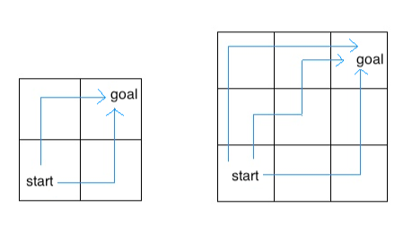
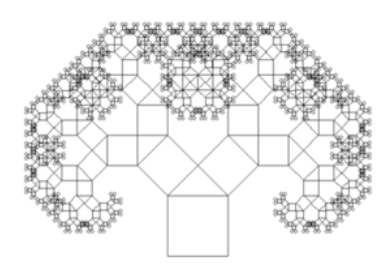
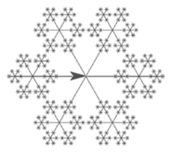

# IST502 Data Structure

## Homework 2: More Recursion

1. Given the code to calculate n choose r combination below

```txt
def comb(n, r):
    if n == r:
        return 1
    if r == 0:
        return 1
    return comb(n-1, r-1) + comb(n-1, r)

print(comb(35, 11))
```

This code is inefficient because it recomputes a lot of results that have previously been computed. Use the memoization technique to improve the performance of this code and save this new memoized version as ${\color{yellow}comb_memo.py.}$

Hint: use Python’s dictionary as a memo and use Python’s tuple as keys in the memo dictionary.

2. Write a function merge(n1, n2) in ${\color{yellow}merge.py}$ which takes numbers with digits in decreasing order and returns a single number with all of the digits of the two, in decreasing order. Any number merged with 0 will be that number (treat 0 as having no digits). Use recursion.

Hint: If you can figure out which number has the smallest digit out of both, then we know that the resulting number will have that smallest digit, followed by the merge of the two numbers with the smallest digit removed.

```txt
def merge(n1, n2):
    """ Merges two numbers by digit in decreasing order
    >>> merge(31, 42)
    4321
    >>> merge(21, 0)
    21
    >>> merge (21, 31)
    3211
    """
    "*** YOUR CODE HERE ***"
```

3. Write a recursive function in ${\color{yellow}double_eights.py}$ that takes in a number n and determines if the digits contain two adjacent 8s. You can assume that n is at least a two-digit number.

```txt
def double_eights(n):
    """ Returns whether or not n has two digits in row that
    are the number 8. Assume n has at least two digits in it.

    >>> double_eights(1288)
    True
    >>> double_eights(880)
    True
    >>> double_eights(538835)
    True
    >>> double_eights(284682)
    False
    >>> double_eights(588138)
    True
    >>> double_eights(78)
    False

    """
    "*** YOUR CODE HERE ***"
```

4. Consider an insect in an M by N grid. The insect starts at the bottom left corner, (1, 1), and wants to end up at the top right corner, (M, N). The insect is only capable of moving right or up. Write a recursive function in ${\color{yellow}path.py}$ that takes a grid length and width and returns the number of different paths the insect can take from the start to the goal.



For example, the 2 by 2 grid has a total of two ways for the insect to move from the start to the goal. For the 3 by 3 grid, the insect has 6 different paths (only 3 are shown above).
Hint: What happens if we hit the top or rightmost edge?

```txt
def paths(m, n):
    """Return the number of paths from one corner of an
    M by N grid to the opposite corner.

    >>> paths(2, 2)
    2
    >>> paths(5, 7)
    210
    >>> paths(117, 1)
    1
    >>> paths(1, 157)
    1
    """
    "*** YOUR CODE HERE ***"
```

5. Write a Python code in ${\color{yellow}realistic_tree.py}$ that generates a tree image similar to the one shown below. Note that the branches get smaller as they are closer to the leaves. And, all leaves are green whereas all branches are brown.


6. Write a Python code in ${\color{yellow}pythagorus_tree.py}$ that generates an image similar to the one shown below.



7. Write a Python code in ${\color{yellow}snowflakes.py}$ that generates an image similar to the one shown below.



## Submission

- Create a submission folder, StudentID_Firstname_HW2, where StudentID is your VISTEC
- ID and Firstname is your given name
- Put all the Python files to submit into this folder
- Write a report in a file called HW2_report.pdf to tell the instructor, for each problem:
  - Do you completely finish it or there are parts that you cannot finish because of bugs or other difficulties?
  - Approximately how long do you take to tackle it and what is the most difficult part of that problem?
  - Provide sample screenshot results for each problem.
- Include this HW2_report.pdf to the submission folder. ${\color{red}No report = no scores.}$
- Zip the submission folder and submit the zip file to the link posted on the class website on or before the due date
