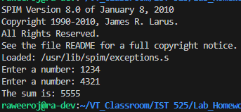
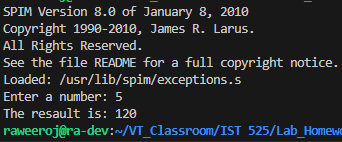
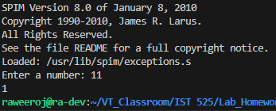

# Class assignment 1.1
My computer setup
- OS : Ubuntu Server 22.04.3 LTS
- Kernel : 5.15.0-82-generic
- SIM : SPIM 8.0 (01/2010)

## How to run
1. Install SPIM 
```bash
sudo apt install spim
```
2. Run the program
```bash
spim run [your_program.s]
```

## Resault
1_add_func.s




2_factorials_func.s




3_prime_func.s

